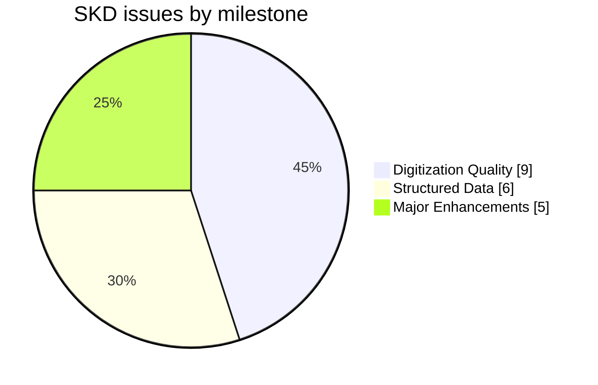
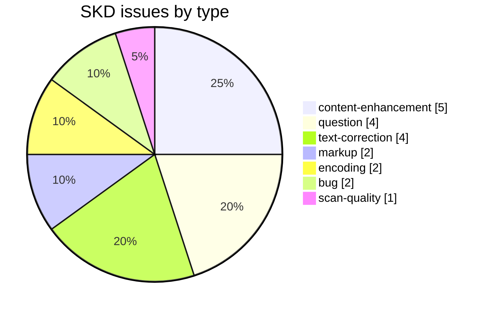
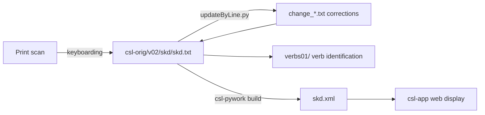

# SKD — *Śabda-kalpadruma* (1822)

Development and correction repository for **Rājā Rādhākānta Deva's *Śabda-kalpadruma***, an indigenous Sanskrit→Sanskrit encyclopedic lexicon, part of the [Cologne Digital Sanskrit Lexicon](https://www.sanskrit-lexicon.uni-koeln.de/) (CDSL). The canonical source text lives in [`csl-orig/v02/skd/skd.txt`](https://github.com/sanskrit-lexicon/csl-orig/blob/main/v02/skd/skd.txt) (40,817 entries); this repository holds the development, correction, and enrichment work.

An indigenous encyclopedic lexicon that cites classical authorities through quotations (`“…”`), abbreviated source sigla and `iti`, rather than Western `<ls>` markup.

## Documentation

- [CLAUDE.md](CLAUDE.md) — repository guide and data-format reference.
- [DATA_DICTIONARY.md](DATA_DICTIONARY.md) — markup tag reference.
- [CONTRIBUTING.md](CONTRIBUTING.md) · [CODE_OF_CONDUCT.md](CODE_OF_CONDUCT.md)

## Contents

| Path | Purpose |
|---|---|
| `2014/` | 2014 digitization working files |
| `corrections/` | Correction working files |
| `issues/` | Per-issue working files |
| `verbs01/` | Verb identification: maps verb entries to MW roots, with Devanāgarī renderings |

## Timeline

| Period | Activity |
|---|---|
| 2014 | Repository activity begins (first tracked issues) |
| 2017–2025 | Ongoing corrections, markup, and comparison work |
| 2026-05 | Issue taxonomy, citation metadata, documentation |

## Projects & Milestones

| Milestone | Open | Closed | Total |
|---|---|---|---|
| Dictionary to Book | 0 | 0 | 0 |
| Digitization Quality | 5 | 4 | 9 |
| Structured Data | 3 | 3 | 6 |
| Major Enhancements | 5 | 0 | 5 |
| **Total** | **13** | **7** | **20** |

## Issues

### Open

| # | Title | Type | Severity | Milestone |
|---|---|---|---|---|
| 1 | Correction 'dbika' to 'dvika' | text-correction | minor | Digitization Quality |
| 2 | alphabetizing errors in skd headwords | text-correction | minor | Digitization Quality |
| 3 | Removed another headword normalization from skd | text-correction | minor | Digitization Quality |
| 6 | Wikisource शब्दकल्पद्रुमः Edition | question | minor | Structured Data |
| 8 | All Dhatu Entries (SKD) | content-enhancement | medium | Major Enhancements |
| 9 | vcp-skd comparison | content-enhancement | medium | Major Enhancements |
| 10 | vcp-skd1 comparison, part 2 | content-enhancement | medium | Major Enhancements |
| 11 | SKD digitization (Devanagari version) | content-enhancement | medium | Major Enhancements |
| 12 | Dhatus Comparison - Interesting facts | question | minor | Structured Data |
| 13 | Corrections in digitisation: Andhrabharati | text-correction | minor | Digitization Quality |
| 17 | transcoding skd.txt | encoding | minor | Digitization Quality |
| 18 | Arlo Griffiths via INDOLOGY | question | minor | Structured Data |
| 20 | docs-pass: SKD documentation review | content-enhancement | medium | Major Enhancements |

### Solved

| # | Title | Type | Severity | Milestone |
|---|---|---|---|---|
| 4 | ड्२अ > ड़ | encoding | minor | Digitization Quality |
| 5 | Year 1822 -> 1886 or 1886-1891 | question | minor | Structured Data |
| 7 | Correction in purANa | bug | minor | Digitization Quality |
| 14 | High-resolution scans used by Thomas Malten for digitizat… | bug | minor | Digitization Quality |
| 15 | Metaline <pc> not containing the column data | markup | minor | Structured Data |
| 16 | SKD replace scans | scan-quality | minor | Digitization Quality |
| 19 | [markup] Minor skd.txt Markup Oddities | markup | minor | Structured Data |

## Labels

### Type labels

| Label | Meaning |
|---|---|
| `link-target` | Click-throughs from `<ls>` abbreviations to scanned PDF pages |
| `link-splitting` | Splitting combined `SOURCE N,N` refs into per-page links |
| `markup` | Normalising XML tag content |
| `text-correction` | Corrections to Sanskrit/Sanskrit definitions or headwords |
| `content-enhancement` | New material or structural additions beyond correction |
| `encoding` | SLP1/IAST transcoding, character normalisation |
| `scan-quality` | Replacing blurry/skewed/missing scan pages |
| `bug` | Broken links, XML errors, broken downloads |
| `question` | Scholarly questions requiring research |

### Severity labels

| Label | Meaning |
|---|---|
| `minor` | Targeted fix — a handful of lines or a single file |
| `medium` | Standard unit of work — one batch of corrections |
| `hard` | Large effort spanning many sources or files |

## Contributors

| Contributor | Commits |
|---|---|
| funderburkjim | 48 |
| gasyoun (Mārcis Gasūns) | 8 |
| AnnaRybakovaT | 1 |

## Source

- **Author**: Deva, Rādhākānta
- **Title**: *Śabda-kalpadruma*
- **Place / Publisher**: Calcutta
- **Year(s)**: 1822; digitized from the 1886 edition
- **Language pair**: Sanskrit → Sanskrit
- **Size (CDSL headword index)**: 40,817 entries
- **License (digital edition)**: CC BY-SA 4.0
- See [CITATION.cff](CITATION.cff) for machine-readable citation.

## Encoding

- UTF-8 (NFC) throughout.
- Sanskrit text in SLP1 transliteration, wrapped in `{#…#}`; Sanskrit gloss / italic display text in ``.
- Devanāgarī and IAST display forms are generated at display time, not stored in the source.

## How it works

---
*Issue taxonomy and documentation per the [Cologne issue runbook](https://github.com/sanskrit-lexicon/csl-observatory/blob/main/runbook/cologne-issue-runbook.md).*
